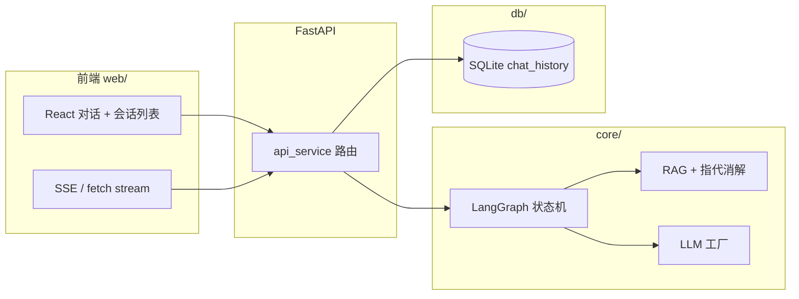

# ZJ Agent Service Toolkit

**LangGraph 多 Agent 编排 · RAG 混合检索 · FastAPI + React 全栈对话**

个人全栈项目：后端用 **LangGraph** 将「安全校验 → 规划路由 → 工具 / 知识库 / 闲聊 → 汇总」建模为状态机；前端 **React + TypeScript + Vite** 提供多轮会话、会话列表与 **SSE** 流式输出；数据层 **SQLite** 持久化会话，**Chroma + BM25** 做知识检索。适合作为简历/GitHub 首页的**可运行、可部署**作品仓库。

---

## 亮点（适合写在简历里的一句话）

- **编排**：LangGraph `StateGraph` + 条件分支，状态驱动多 Agent 流水线，非「单文件 if-else 大脚本」。
- **RAG**：向量库（Chroma）+ 关键词（BM25）+ 指代消解改写检索问句；支持增量/重建索引。
- **工程化**：FastAPI 路由分层、Pydantic 校验、SlowAPI 限流、全局异常与日志；CLI 与 HTTP **共用同一套图与仓储**。
- **前端**：会话列表、历史恢复、`sessionStorage` 与接口联动；对话 **SSE**（汇总阶段 `llm.stream`）。

---

## 功能一览

| 模块 | 说明 |
|------|------|
| 对话 API | 多轮会话（`session_id` + SQLite `chat_history`）；提示词中注入历史 |
| 流式 SSE | `POST /api/agent/chat/stream`，图在汇总前 `interrupt`，汇总用流式与前端打字机效果 |
| 会话列表 | `GET /api/agent/sessions` 聚合展示；`GET /api/agent/chat/history` 按会话拉消息 |
| 路由规划 | LLM 输出 `tool` / `rag` / `chat` 三分支 |
| 工具链 | LangChain 意图 JSON + 可注册工具（计算、时间、文件等） |
| 安全 | 入口节点输入校验 |
| 运维接口 | 清会话、切换 LLM、RAG 索引等（见 `service/api_service.py`） |

---

## 技术栈

| 层级 | 技术 |
|------|------|
| 编排 & LLM | **LangGraph**, **LangChain**, `langchain-openai`（DeepSeek / OpenAI 兼容） |
| Web 后端 | **FastAPI**, **Uvicorn**, **Pydantic v2**, **SlowAPI** |
| 数据 | **SQLAlchemy 2**, **SQLite** |
| RAG | **Chroma**, **sentence-transformers**, **rank-bm25**, **pypdf** |
| 前端 | **React 18**, **TypeScript**, **Vite**, CSS Modules |
| 配置 | **python-dotenv** |

---

## 架构简图



**工作流（与代码一致）**：`security_check` → `planner_agent` → `tool` / `rag` / `chat` 分支 → `summary_agent`（或 SSE 路径下在 HTTP 层流式汇总）。详见仓库内 `core/graph.py` 与 `agent_graph.png`（若本地生成成功）。

---

## 目录结构

```
zj-agent-service-toolkit/
├── agent/                 # 独立 BaseAgent（工具链演示等）
├── config/                # 配置、日志、限流、异常处理
├── core/                  # LangGraph、状态、RAG、多 Agent、提示词
├── db/                    # SQLAlchemy 模型与 chat 仓储
├── security/              # 输入安全校验
├── service/               # FastAPI 路由、CLI 入口
├── toolkit/               # 可插拔工具注册
├── web/                   # React + TS 前端（Vite）
│   ├── src/
│   └── vite.config.ts     # 开发代理 /api → 后端
├── knowledge/             # RAG 文档目录（默认）
├── data/                  # SQLite 数据文件（默认 agent.db）
├── app.py                 # FastAPI 应用入口
├── main.py                # CLI / 维护入口
├── requirements.txt
└── README.md
```

---

## 快速开始

### 环境要求

- **Python 3.11+**（推荐）
- **Node.js 18+**（仅本地开发 / 构建前端）

### 1. 后端

```bash
cd zj-agent-service-toolkit
python3.11 -m venv .venv
source .venv/bin/activate   # Windows: .venv\Scripts\activate
pip install -r requirements.txt
```

复制示例并编辑（勿将 `.env` 提交 Git）：

```bash
cp .env.example .env
```

至少配置 **大模型 API Key** 与 **`DEFAULT_LLM_PROVIDER`**；其余变量有默认值，完整说明见下文「主要环境变量」。

启动 API：

```bash
uvicorn app:app --reload --host 0.0.0.0 --port 8000
```

命令行对话（与 Web 共用仓储与图）：

```bash
python main.py
```

### 2. 前端

```bash
cd web
npm install
npm run dev
```

浏览器访问终端提示的地址（一般为 `http://localhost:5173`）。开发环境下 `/api` 由 Vite 代理到 `http://127.0.0.1:8000`。

生产构建：

```bash
cd web && npm run build
# 静态资源在 web/dist，可由 Nginx 反代 /api 到后端
```

### 3. RAG 索引（可选）

```bash
python main.py --index-rag
# 全量重建（会按实现清空向量目录后重建）
python main.py --index-rag --rebuild
```

---

## 主要环境变量（`.env`）

| 变量 | 说明 |
|------|------|
| `DEEPSEEK_API_KEY` / `DEEPSEEK_BASE_URL` / `DEEPSEEK_MODEL` | DeepSeek 通道 |
| `OPENAI_API_KEY` / `OPENAI_BASE_URL` / `OPENAI_MODEL` | OpenAI 兼容通道 |
| `DEFAULT_LLM_PROVIDER` | `deepseek` 或 `openai` |
| `SQLITE_PATH` | SQLite 路径，默认 `./data/agent.db` |
| `RAG_KNOWLEDGE_DIR` | 知识库目录，默认 `./knowledge` |
| `CHROMA_DB_DIR` | Chroma 持久化目录 |

其余 RAG、混合检索、嵌入缓存等见 `config/settings.py`。

---

## HTTP API 摘要

前缀：`/api/agent`（由 `app.py` 挂载 `service/api_service` 路由）。

| 方法 | 路径 | 说明 |
|------|------|------|
| `POST` | `/chat` | 非流式对话，返回 JSON |
| `POST` | `/chat/stream` | SSE 流式对话 |
| `GET` | `/chat/history?session_id=` | 某会话全部消息 |
| `GET` | `/sessions?limit=` | 会话列表（聚合） |
| `GET` | `/api/agent/visualize` | LangGraph 工作流 PNG（定义在 `app.py`） |

运维类：`/admin/reset-session`、`/admin/switch-llm`、`/admin/index-rag` 等。

---

## 求职 / GitHub 首页使用建议

1. **置顶本仓库** 或放在 Profile README 中链过来，并补一句个人介绍（技术栈、求职方向）。
2. **准备可演示环境**：例如录屏「多轮 + 切会话 + SSE」或部署一页 Demo（注意 API Key 仅放服务端环境变量）。
3. **面试话术**：能讲清「为何用 LangGraph」「RAG 为何加 BM25 / 指代消解」「SSE 为何 interrupt 在 summary 前」等设计取舍。

---

## 声明

- 请勿将 **`.env`**、数据库文件、向量库大文件提交到公开仓库；`.gitignore` 已忽略常见敏感与产物路径。
- 第三方模型与向量服务的使用需遵守各自条款与计费规则。

---

## 联系作者

- **GitHub 主页**：[https://github.com/zhjing1019](https://github.com/zhjing1019)
- **邮箱**：[zhangjing951019@163.com](mailto:zhangjing951019@163.com)
