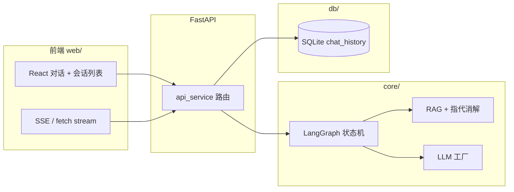

# ZJ Agent Service Toolkit
# zj-agent-service-toolkit
轻量级、可扩展的Agent服务化工具包，聚焦「企业级Agent落地」场景，解决原生LLM/Agent框架在工程化、可复用性、多场景适配的痛点。

## 核心价值
1. 开箱即用：封装Agent核心能力（任务拆解、工具调用、记忆管理、多轮对话），支持10分钟快速搭建生产级Agent服务；
2. 多端适配：提供RESTful API/GRPC/CLI三种调用方式，兼容私有化部署/云原生部署；
3. 可扩展：插件化设计，支持自定义LLM适配器（已适配OpenAI/智谱AI/通义千问）、自定义工具（比如数据库查询/文件解析）；
4. 工程化：内置日志、监控、限流、重试机制，配套单元测试（覆盖率80%+）和Docker部署脚本。

## 核心功能
- 基础Agent能力：任务规划、工具调用链、长短期记忆（基于Redis/向量库）；
- 服务化封装：统一的Agent调度中心，支持多Agent协作（比如分工执行复杂任务）；
- 适配层：屏蔽不同LLM厂商接口差异，一键切换模型；
- 运维能力：Agent运行日志审计、性能监控面板、异常重试/降级。

## 技术栈
核心：Python 3.10、LangChain 0.1.0、FastAPI
存储：Redis（缓存/记忆）、PostgreSQL（任务/日志存储）
部署：Docker、Docker Compose
测试：Pytest、Coverage
监控：Prometheus + Grafana（可选）

## 亮点

- **编排**：LangGraph `StateGraph` + 条件分支，状态驱动多 Agent 流水线，非「单文件 if-else 大脚本」。
- **RAG**：向量库（Chroma）+ 关键词（BM25）+ 指代消解改写检索问句；**知识库图片**：CLIP 图文向量检索 + 可选 BLIP 或 `图片文件名.caption.txt` 侧写描述；支持增量/重建索引。
- **工程化**：FastAPI 路由分层、Pydantic 校验、SlowAPI 限流、全局异常与日志；CLI 与 HTTP **共用同一套图与仓储**。
- **任务断点续跑**：完整 LangGraph 图挂载 **SqliteSaver** 检查点；`POST /chat` 可带 `checkpoint_thread_id`，异常中断后 `POST /task/resume` 从下一节点继续（非整图重跑）；元数据见表 `agent_task_run`。

---

## 功能一览

| 模块 | 说明 |
|------|------|
| 对话 API | 多轮会话（`session_id` + SQLite `chat_history`）；提示词中注入历史 |
| 流式 SSE | `POST /api/agent/chat/stream`，图在汇总前 `interrupt`，汇总用流式与前端打字机效果 |
| 会话列表 | `GET /api/agent/sessions` 聚合展示；`GET /api/agent/chat/history` 按会话拉消息 |
| 路由规划 | LLM 输出 `tool` / `rag` / `chat` / `degraded`（规划失败降级直出） |
| RAG / 图片 | 文本：Chroma + BM25 + 指代消解；**图片**：`knowledge/` 下常见图片格式，索引时 CLIP 编码，RAG 节点按问句检索并拼入上下文；可选 BLIP 或 `.caption.txt` |
| 工具链 | LangChain 意图 JSON + 可注册工具（计算、时间、文件等） |
| 安全 | 入口节点输入校验 |
| 任务检查点 | `POST /chat` 支持 `checkpoint_thread_id`；`POST /task/resume` 续跑；`GET /task/status`、`GET /task/runs` 查询 |

---

## 技术栈

| 层级 | 技术 |
|------|------|
| 编排 & LLM | **LangGraph**, **LangChain**, `langchain-openai`；**langgraph-checkpoint-sqlite**（完整图检查点） |
| Web 后端 | **FastAPI**, **Uvicorn**, **Pydantic v2**, **SlowAPI** |
| 数据 | **SQLAlchemy 2**, **SQLite** |
| RAG | **Chroma**, **sentence-transformers**, **rank-bm25**, **pypdf** |
| 前端 | **React 18**, **TypeScript**, **Vite**, CSS Modules |
| 配置 | **python-dotenv** |

---

## 架构简图



**工作流（与代码一致）**：`security_check` → `planner_agent` → `tool` / `rag` / `chat` / **`degraded`** 分支 → `summary_agent`。其中 `tool`、`rag`、`chat` 各自走完子链路后进入汇总节点；**`degraded`** 为规划阶段大模型在配置的重试与备用提供商（`LLM_FALLBACK_PROVIDER`）仍失败后的降级路径：携带「系统降级」类文案直跳 `summary_agent`，并置 `skip_summary_llm`，不再二次调用汇总 LLM。SSE（`POST /chat/stream`）若已降级，则在 HTTP 层直接推送该文案。详见仓库内 `core/graph.py` 与 `agent_graph.png`（若本地生成成功）。

---

## 目录结构

```
zj-agent-service-toolkit/
├── agent/                 # 独立 BaseAgent（工具链演示等）
├── config/                # 配置、日志、限流、异常处理
├── core/                  # LangGraph、状态、RAG、多 Agent、提示词
├── db/                    # SQLAlchemy 模型与 chat 仓储
├── security/              # 输入安全校验
├── service/               # FastAPI 路由、CLI 入口
├── toolkit/               # 可插拔工具注册
├── web/                   # React + TS 前端（Vite）
│   ├── src/
│   └── vite.config.ts     # 开发代理 /api → 后端
├── knowledge/             # RAG 文档目录（默认）
├── data/                  # SQLite 数据文件（默认 agent.db）
├── app.py                 # FastAPI 应用入口
├── main.py                # CLI / 维护入口
├── requirements.txt
└── README.md
```

---

## 快速开始

### 环境要求

- **Python 3.11+**（推荐）
- **Node.js 18+**（仅本地开发 / 构建前端）

### 1. 后端

```bash
cd zj-agent-service-toolkit
python3.11 -m venv .venv
source .venv/bin/activate   # Windows: .venv\Scripts\activate
pip install -r requirements.txt
```

复制示例并编辑（勿将 `.env` 提交 Git）：

```bash
cp .env.example .env
```

至少配置 **大模型 API Key** 与 **`DEFAULT_LLM_PROVIDER`**；其余变量有默认值，完整说明见下文「主要环境变量」。

启动 API：

```bash
uvicorn app:app --reload --host 0.0.0.0 --port 8000
```

命令行对话（与 Web 共用仓储与图）：

```bash
python main.py
```

### 2. 前端

```bash
cd web
npm install
npm run dev
```

浏览器访问终端提示的地址（一般为 `http://localhost:5173`）。开发环境下 `/api` 由 Vite 代理到 `http://127.0.0.1:8000`。

生产构建：

```bash
cd web && npm run build
# 静态资源在 web/dist，可由 Nginx 反代 /api 到后端
```

### 3. RAG 索引（可选）

将 `pdf` / `txt` / `md` 与 **`knowledge/` 下的图片**（默认 `.png/.jpg/.jpeg/.webp/.gif/.bmp`）一并索引：文本进 Chroma + BM25；图片用 **CLIP** 写入 `./data/image_rag_manifest.json` 与 `image_rag_embeddings.npy`。图片描述可选：`IMAGE_RAG_BLIP_CAPTION=true` 且已安装 `transformers`，或在图片旁放置 **`同名.caption.txt`**（例如 `logo.png` + `logo.png.caption.txt`）。

```bash
python main.py --index-rag
# 全量重建（会按实现清空向量目录后重建；图片索引亦按 rebuild 清空后重写）
python main.py --index-rag --rebuild
```

---

## 主要环境变量（`.env`）

| 变量 | 说明 |
|------|------|
| `DEEPSEEK_API_KEY` / `DEEPSEEK_BASE_URL` / `DEEPSEEK_MODEL` | DeepSeek 通道 |
| `OPENAI_API_KEY` / `OPENAI_BASE_URL` / `OPENAI_MODEL` | OpenAI 兼容通道 |
| `DEFAULT_LLM_PROVIDER` | `deepseek` 或 `openai` |
| `SQLITE_PATH` | SQLite 路径，默认 `./data/agent.db` |
| `LANGGRAPH_CHECKPOINT_SQLITE_PATH` | LangGraph 检查点库，默认 `./data/langgraph_checkpoints.sqlite`（可与业务库同目录） |
| `RAG_KNOWLEDGE_DIR` | 知识库目录，默认 `./knowledge` |
| `CHROMA_DB_DIR` | Chroma 持久化目录 |
| `IMAGE_RAG_ENABLE` / `IMAGE_RAG_INDEX_DIR` / `IMAGE_RAG_CLIP_MODEL` / `IMAGE_RAG_TOP_K` | 知识库图片 CLIP 检索；索引目录默认 `./data`；模型默认 `clip-ViT-B-32` |
| `IMAGE_RAG_BLIP_CAPTION` | `true` 时索引阶段用 BLIP 生成描述（需 `pip install transformers`） |
| `RBAC_ENABLED` | `true` 时除匿名健康检查外，上述 API 需携带有效 `X-API-Key`（或 `Authorization: Bearer`） |
| `RBAC_ADMIN_API_KEYS` / `RBAC_DEVELOPER_API_KEYS` / `RBAC_BUSINESS_API_KEYS` | 逗号分隔的密钥，分别对应管理员 / 开发者 / 业务用户 |
| `RBAC_BUSINESS_AGENT_IDS` | 业务用户允许执行的 `agent_id`（逗号分隔），默认 `default`（仅 LangGraph 对话） |
| `AGENT_TEMPLATES_FILE` | 自定义模板 JSON 路径，默认 `./data/agent_templates.json` |

其余 RAG、混合检索、嵌入缓存、RBAC 细粒度说明见 `config/settings.py` 与 `security/rbac.py`。

---

## HTTP API 摘要

前缀：`/api/agent`（由 `app.py` 挂载 `service/api_service` 路由）。

| 方法 | 路径 | 说明 |
|------|------|------|
| `POST` | `/chat` | 非流式对话；可选 `agent_id`（仅 `default`）、`checkpoint_thread_id`；响应带回 id |
| `POST` | `/run` | body: `task`、可选 `agent_id`（`base_tool` 为默认），走 BaseAgent 工具链 |
| `GET` | `/memory` | BaseAgent 记忆列表 |
| `POST` | `/task/resume` | body: `{ "checkpoint_thread_id" }`，从检查点 `invoke(None)` 续跑完整图 |
| `GET` | `/task/status?checkpoint_thread_id=` | 查看下一待执行节点等 |
| `GET` | `/task/runs?limit=&session_id=` | 任务运行记录（业务表） |
| `POST` | `/chat/stream` | SSE 流式对话（RBAC 开启时可用查询参数 `api_key`） |
| `GET` | `/chat/history?session_id=` | 某会话全部消息 |
| `GET` | `/sessions?limit=` | 会话列表（聚合） |
| `GET` | `/templates` | Agent 模板列表（业务用户仅能看到白名单内 `agent_id` 的模板） |
| `POST` | `/templates` | 新建自定义模板（仅管理员） |
| `DELETE` | `/templates/{template_id}` | 删除非内置模板（仅管理员） |
| `GET` | `/logs/api?limit=&offset=` | API 调用日志（管理员 / 开发者） |
| `GET` | `/logs/errors?limit=&offset=` | 错误日志（管理员 / 开发者） |
| `GET` | `/visualize` | LangGraph 工作流 PNG（管理员 / 开发者） |

运维类：`/admin/reset-session`、`/admin/switch-llm`、`/admin/index-rag`（**仅管理员**；需 `RBAC_ENABLED=true` 时携带 `X-API-Key`）。

---

## 求职 / GitHub 首页使用建议

1. **置顶本仓库** 或放在 Profile README 中链过来，并补一句个人介绍（技术栈、求职方向）。
2. **准备可演示环境**：例如录屏「多轮 + 切会话 + SSE」或部署一页 Demo（注意 API Key 仅放服务端环境变量）。
3. **面试话术**：能讲清「为何用 LangGraph」「RAG 为何加 BM25 / 指代消解」「SSE 为何 interrupt 在 summary 前」等设计取舍。

---

## 声明

- 请勿将 **`.env`**、数据库文件、向量库大文件提交到公开仓库；`.gitignore` 已忽略常见敏感与产物路径。
- 第三方模型与向量服务的使用需遵守各自条款与计费规则。

---

## 联系作者

- **GitHub 主页**：[https://github.com/zhjing1019](https://github.com/zhjing1019)
- **邮箱**：[zhangjing951019@163.com](mailto:zhangjing951019@163.com)
