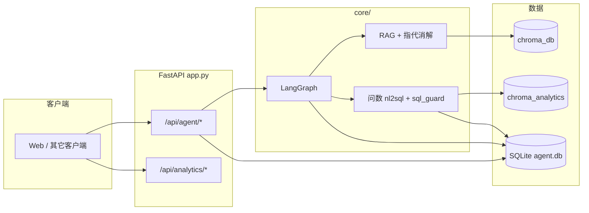

# ZJ Agent Service Toolkit

轻量级、可扩展的 Agent 服务化工具包，面向「企业级 Agent 落地」：在 **FastAPI + LangGraph** 上提供多轮对话、RAG、工具调用、**业务库自然语言问数（NL2SQL）**、检查点续跑与基础 RBAC。

---

## 核心价值

1. **开箱即用**：LangGraph 状态机 + 规划路由（工具 / 文档 RAG / **业务问数** / 闲聊 / 降级），与 SQLite 会话、任务运行表打通。  
2. **多端接入**：**REST API**（对话、流式 SSE、问数）、**CLI**（`main.py` 与 HTTP 共用同一套图与仓储）；可按需自行封装 gRPC。  
3. **可扩展**：LLM 工厂（DeepSeek / OpenAI 兼容）、工具注册表、RAG 目录与问数业务 YAML 可独立演进。  
4. **工程化**：限流、全局异常、API/错误日志、可选 RBAC；问数链路含 **SQL 硬校验（sqlglot）** 与只读执行。

---

## 核心功能

- **对话与流式**：多轮 `session_id` + `chat_history`；`POST /api/agent/chat/stream`（SSE，汇总前 interrupt）。  
- **规划路由**：`tool` / `rag` / **`analytics`**（演示库问数）/ `chat` / `degraded`（规划失败直出）。  
- **RAG**：Chroma + BM25 + 指代消解；知识库图片 CLIP 检索（可选 BLIP / `.caption.txt`）。  
- **AI 问数**：业务词典 YAML + 表结构 → **独立向量库** `chroma_analytics`；自然语言 → LLM 生成 SQL → **`sql_guard` 校验** → 只读查 `ma_*` → 小结。  
- **任务断点续跑**：LangGraph **SqliteSaver**；`checkpoint_thread_id` + `POST /api/agent/task/resume`。  
- **前端**：`web/`（React + TypeScript + Vite），开发时代理 `/api` 到后端。

---

## 技术栈

| 层级 | 技术 |
|------|------|
| 编排 & LLM | **LangGraph**、**LangChain** ≥0.3、`langchain-openai`、`langgraph-checkpoint-sqlite` |
| Web | **FastAPI**、Uvicorn、Pydantic v2、SlowAPI |
| 数据 | **SQLAlchemy 2**、**SQLite**（业务演示表 + 会话/检查点/日志） |
| RAG | **Chroma**、sentence-transformers、rank-bm25、pypdf |
| 问数 | **sqlglot**、Chroma（**`ANALYTICS_CHROMA_DIR`**，与主 RAG 目录分离）、PyYAML |
| 前端 | React 18、TypeScript、Vite |
| 配置 | python-dotenv |

---

## 亮点

- **编排**：`StateGraph` + 条件分支；问数可走 **独立节点** `analytics_answer_agent`（内部 `run_nl_query`），避免订单类问题误走文档 RAG。  
- **RAG**：向量 + BM25 混合、检索前指代消解；图片侧 CLIP 与可选描述。  
- **问数安全**：仅 `SELECT`（含 `WITH`）、单语句、物理表名前缀白名单（默认 `ma_`）；详见 `core/analytics/sql_guard.py`。  
- **工程化**：路由分层、限流、异常与日志；CLI 与 HTTP 共用核心逻辑。  
- **断点续跑**：完整图挂载检查点，支持 `invoke(None)` 续跑。

---

## 功能一览

| 模块 | 说明 |
|------|------|
| 对话 API | `POST /api/agent/chat`；`session_id` + SQLite `chat_history` |
| 流式 SSE | `POST /api/agent/chat/stream` |
| 会话与历史 | `GET /api/agent/sessions`、`GET /api/agent/chat/history` |
| 路由规划 | `tool` / `rag` / **`analytics`** / `chat` / `degraded` |
| RAG / 图片 | 文本：`knowledge/` + Chroma + BM25；图片：CLIP 等（见下文 RAG 索引） |
| **AI 问数** | `POST /api/analytics/nl-query`；`POST /api/analytics/reindex-analytics` |
| 工具链 | 意图 JSON + `toolkit/` 注册工具 |
| 安全 | 入口输入校验；问数 SQL 二次校验 |
| 任务检查点 | `checkpoint_thread_id`、`/task/resume`、`/task/status`、`/task/runs` |

---

## 架构简图



**主对话工作流**（`core/graph.py`）：`security_check` → `planner_agent` → `tool` / `rag` / **`analytics`** / `chat` / `degraded` → `summary_agent`。  
`degraded`：规划阶段重试与备用模型仍失败时，携带降级文案直跳汇总且 `skip_summary_llm`。工作流图可本地生成 `agent_graph.png`（依赖 graphviz 等，失败时写入 `agent_graph.mmd`）。

---

## AI 问数（NL2SQL）说明

与「文档 RAG」分离的一条能力：**查演示库里的 `ma_*` 表**（订单、客户、分院等）。

| 环节 | 位置 |
|------|------|
| 业务词典 | `knowledge/analytics_business.yaml`（别名、口径、JOIN 提示） |
| 表结构进向量 | 索引时从 SQLite 读取 `ma_*` 列信息，与 YAML 一并写入 `chroma_analytics` |
| 重建索引 | `python -m core.analytics.reindex` 或 `POST /api/analytics/reindex-analytics` |
| 编排与固定模板 | `core/analytics/nl2sql.py` |
| SQL 校验 | `core/analytics/sql_guard.py` |
| 只读执行 | `core/analytics/executor.py` |
| HTTP | `service/analytics_api.py`（已在 `app.py` 挂载） |

**从零配置问数**：按 **`docs/AI_ANALYTICS_SETUP.md`** 逐步操作。表清单与域说明见 **`docs/MA_TABLES_REFERENCE.md`**。

---

## 目录结构

```
zj-agent-service-toolkit/
├── agent/                    # BaseAgent 等独立示例
├── config/                   # 配置、日志、限流、异常
├── core/                     # LangGraph、RAG、多 Agent、提示词
│   └── analytics/            # 问数：索引、检索、sql_guard、nl2sql、reindex CLI
├── db/                       # SQLAlchemy 模型、init、chat 仓储
├── security/                 # 输入安全、RBAC
├── service/                  # FastAPI：api_service、analytics_api
├── toolkit/                  # 可插拔工具
├── web/                      # React + TS + Vite
├── knowledge/                # 主 RAG 文档；问数业务 YAML（默认 analytics_business.yaml）
├── docs/                     # AI_ANALYTICS_SETUP.md、MA_TABLES_REFERENCE.md 等
├── data/                     # SQLite、上传图、图片 RAG 产物等（勿提交敏感数据）
├── app.py                    # FastAPI 入口（挂载 agent + analytics）
├── main.py                   # CLI / RAG 索引维护
├── requirements.txt
└── README.md
```

---

## 快速开始

### 环境要求

- **Python 3.11+**（推荐）  
- **Node.js 18+**（仅本地开发 / 构建前端）

### 1. 后端

```bash
cd zj-agent-service-toolkit
python3.11 -m venv .venv
source .venv/bin/activate   # Windows: .venv\Scripts\activate
pip install -r requirements.txt
```

复制并编辑环境变量（勿将 `.env` 提交 Git）：

```bash
cp .env.example .env
```

至少配置 **大模型 API Key** 与 **`DEFAULT_LLM_PROVIDER`**（`deepseek` 或 `openai`）。

初始化数据库并启动 API：

```bash
.venv/bin/python -c "from db.init_db import init_database; init_database()"
uvicorn app:app --reload --host 0.0.0.0 --port 8000
```

命令行对话（与 Web 共用仓储与图）：

```bash
python main.py
```

### 2. 前端

```bash
cd web
npm install
npm run dev
```

开发环境一般访问 `http://localhost:5173`，`/api` 由 Vite 代理到 `http://127.0.0.1:8000`。

生产构建：

```bash
cd web && npm run build
```

静态资源在 `web/dist`，由 Nginx 等反代 `/api` 到后端。

### 3. 主 RAG 索引（可选）

将 `pdf` / `txt` / `md` 与 **`knowledge/` 下图片** 一并索引（文本 Chroma + BM25；图片 CLIP）。可选 BLIP 或 **`同名.caption.txt`** 描述。

```bash
python main.py --index-rag
python main.py --index-rag --rebuild
```

### 4. 问数向量索引（使用 NL2SQL 前必做）

```bash
.venv/bin/python -m core.analytics.reindex
```

或服务启动后：`POST http://127.0.0.1:8000/api/analytics/reindex-analytics`。

然后调用：`POST http://127.0.0.1:8000/api/analytics/nl-query`，body：`{"question":"自然语言问题"}`。返回中含 **`sql`**、**`rows`**、**`validation_error`**、**`used_canonical_template`** 等字段。

---

## 主要环境变量（`.env`）

| 变量 | 说明 |
|------|------|
| `DEEPSEEK_API_KEY` / `DEEPSEEK_BASE_URL` / `DEEPSEEK_MODEL` | DeepSeek 通道 |
| `OPENAI_API_KEY` / `OPENAI_BASE_URL` / `OPENAI_MODEL` | OpenAI 兼容通道 |
| `DEFAULT_LLM_PROVIDER` | `deepseek` 或 `openai` |
| `LLM_FALLBACK_PROVIDER` | 可选备用提供商 |
| `SQLITE_PATH` | 业务与聊天等 SQLite，默认 `./data/agent.db` |
| `LANGGRAPH_CHECKPOINT_SQLITE_PATH` | LangGraph 检查点库路径 |
| `RAG_KNOWLEDGE_DIR` | 主 RAG 知识库目录，默认 `./knowledge` |
| `CHROMA_DB_DIR` | 主 RAG Chroma 目录 |
| **`ANALYTICS_CHROMA_DIR`** | **问数专用** Chroma，默认 `./chroma_analytics`（勿与 `CHROMA_DB_DIR` 混用） |
| **`ANALYTICS_BUSINESS_YAML`** | 问数业务词典，默认 `./knowledge/analytics_business.yaml` |
| **`ANALYTICS_ROW_LIMIT`** / **`ANALYTICS_TOP_K`** / **`ANALYTICS_ALLOWED_TABLE_PREFIX`** | 问数行上限、检索条数、允许表名前缀（默认 `ma_`） |
| `IMAGE_RAG_*` | 知识库图片检索相关 |
| `RBAC_ENABLED` / `RBAC_*_API_KEYS` / `RBAC_BUSINESS_AGENT_IDS` | 可选 API Key 与角色 |

更多项见 `config/settings.py`、`security/rbac.py`。

---

## HTTP API 摘要

### 前缀 `/api/agent`（`service/api_service.py`）

| 方法 | 路径 | 说明 |
|------|------|------|
| `POST` | `/chat` | 非流式对话；可选 `checkpoint_thread_id` |
| `POST` | `/chat/stream` | SSE 流式（RBAC 开启时可用查询参数 `api_key`） |
| `GET` | `/sessions` | 会话列表 |
| `GET` | `/chat/history` | 按 `session_id` 拉消息 |
| `POST` | `/run` | BaseAgent 工具链，`task` + 可选 `agent_id` |
| `GET` | `/memory` | BaseAgent 记忆列表 |
| `POST` | `/task/resume` | 检查点续跑 |
| `GET` | `/task/status` | 下一节点等 |
| `GET` | `/task/runs` | 任务运行记录 |
| `POST` | `/chat/upload-image` | 聊天附图上传 |
| `GET` | `/templates` 等 | Agent 模板 CRUD（RBAC 分角色） |
| `GET` | `/logs/api`、`/logs/errors` | 日志（管理员/开发者） |
| `GET` | `/visualize` | 工作流可视化（管理员/开发者） |
| `POST` | `/admin/*` | 重置会话、切换 LLM、触发主 RAG 索引（管理员） |

### 前缀 `/api/analytics`（`service/analytics_api.py`）

| 方法 | 路径 | 说明 |
|------|------|------|
| `POST` | `/nl-query` | 自然语言问数，body：`{"question":"..."}` |
| `POST` | `/reindex-analytics` | 重建问数向量库（会 `init_database`） |

---

## 求职 / GitHub 首页使用建议

1. 置顶本仓库或 Profile 中链接，并补一句个人介绍（栈与方向）。  
2. 准备可演示环境：多轮对话、会话切换、SSE、或问数接口返回 `sql` + 表格。  
3. 面试可讲：为何用 LangGraph；RAG 为何加 BM25 / 指代消解；问数为何独立向量库 + SQL 校验；SSE 为何在 summary 前 interrupt。

---

## 声明

- 请勿将 **`.env`**、含隐私的数据库文件、大体积向量库提交到公开仓库；`.gitignore` 已忽略常见路径。  
- 第三方模型与向量服务需遵守各自条款与计费规则。

---

## 联系作者

- **GitHub**：[https://github.com/zhjing1019](https://github.com/zhjing1019)  
- **邮箱**：[zhangjing951019@163.com](mailto:zhangjing951019@163.com)
